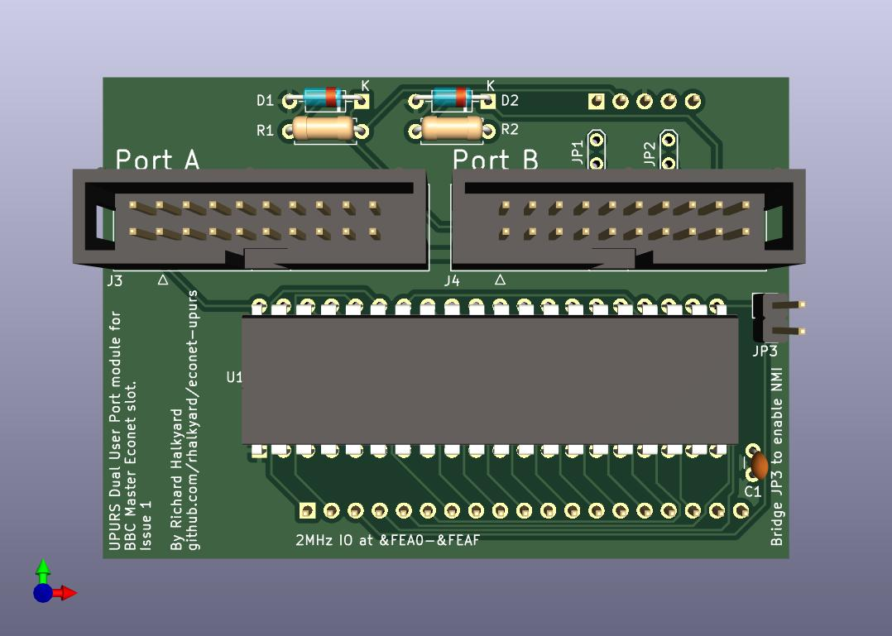
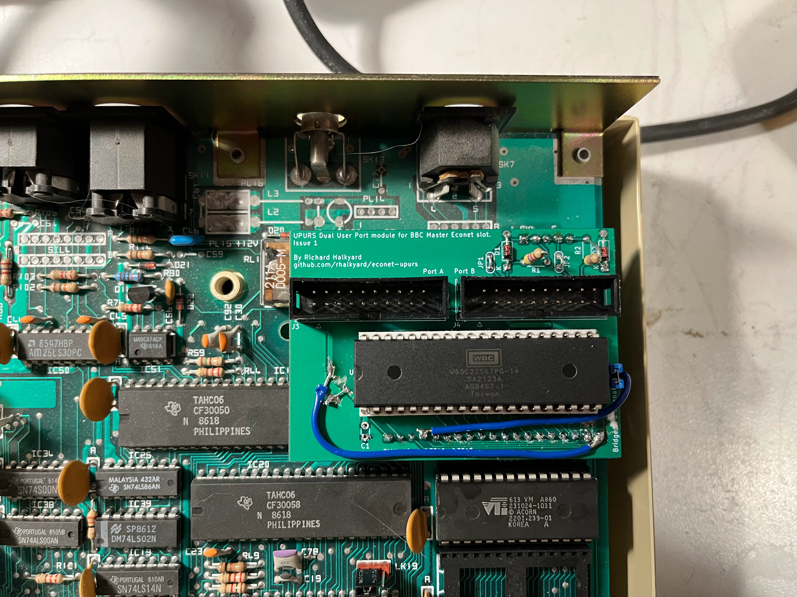

# UPURS Dual User Port module for BBC Master Econet Slot

The BBC Master had optional support for Acorn's Econet network. Oddly, all machines had an Econet DIN-5 port populated on the back panel, while the optional hardware to support it was placed on a daughtercard.

This card instead uses the Econet slot to provide a pair of extra user ports, placing a 65C22 VIA at the I/O addresses reserved for the Econet hardware. Additionally, it repurposes the unused Econet port on the back panel for a [UPURS](https://www.retro-kit.co.uk/UPURS/) serial port.

3D rendering of PCB:


Early prototype installed in my BBC Master (excuse the bodge wires, that issue has been resolved)


## Bill of Materials

Reference   | Description
------------|------------
C1          | 0.1 uF ceramic
D1, D2      | 1N4148 (or similar)
J1          | 0.1" pin header, 19x1 pins
J2          | 0.1" pin header, 5x1 pins
J3, J4      | 0.1" pin header, 10x2 pins, shrouded
R1, R2      | 4.7Kohm
U1          | W65C22N VIA, 40 pin DIP

## UPURS

[UPURS](https://www.retro-kit.co.uk/UPURS/) is a fast software-driven RS232 interface, commonly used for exchanging data with modern PCs.

By populating R1, R2, D1 and D2, and bridging JP1 and JP2, the otherwise-unused Econet port can be connected to a serial port for use with UPURS by wiring a cable as follows:

Signal | 180° 5-pin DIN plug  | DE-9 socket
-------|----------------------|-------------
TXD    | 1                    | 3
CTS    | 4                    | 8
Ground | 2                    | 5
RTS    | 5                    | 7
RXD    | 3                    | 2

(note that pins on the DIN plug are numbered as follows, looking at the back of the computer):

```

1           3
   4     5
      2
```

A version of the UPURS software, modified to support this hardware configuration can be found in [this StarDot.co.uk thread](https://stardot.org.uk/forums/viewtopic.php?p=73960&sid=e43f65395b8c5ee131d509cb647cd489#p73960).

## Software Compatibility

In order to use the extra user ports, software must be modified to communicate with the new VIA at `&FEA0` instead of the User VIA at `&FE60`. If only the VIA base address is converted, software will use Port B. To use Port A, software will need to be modified to use `&FEA1` as the port register, and `&FEA3` as the data-direction register. If the synchronous serial port or handshaking functions are to be used with Port A, then further modifications will need to be made.

### Interrupts

The only interrupt line available on the Econet slot is NMI. By default, the VIA's interrupt output is left disconnected, as handling NMIs correctly under MOS is somewhat complicated.

If you want to be able to generate interrupts, bridge jumper J3 to connect the VIA's interrupt output to NMI. Software that wishes to use NMIs must issue appropriate service calls to claim and release the NMI handler area at `&D00`, install their own handler code there, and accept incoming service call requests to release the handler.

### Timing

The Econet slot is clocked off the 'raw' Phi2 CPU clock, rather than the 1MHz clock of the user VIA. This may cause timing complications:

* Reads and writes will occur at 2MHz, which may throw off timing-sensitive bit-banging.

* Timers will count inconsistently - at 2MHz during RAM and ROM accesses, but 1MHz during most I/O accesses.

## Econet Slot Information

If you want to build your own hardware to fit the Master's Econet slot, this information might be of use:

The Econet slot provides 16 addresses from `&FEA0`-`&FEAF`, accessed at the full 2MHz CPU speed. The `/NMI` interrupt line is exposed as `/NETINT` and suitable for either TTL or open-collctor outputs, but `/IRQ` is not available.

### Pinouts

#### SK5 (Econet Module bus connector)

SK5 is a 1x19 socket with 0.1" pin spacings, suitable for regular square-pin headers.

For some reason, the pins are numbered A, B, 1..17, instead of 1..19.

Pins are numbered from left to right, when viewing the computer from the front.

Pin   | Signal
------|-------
A     | A3
B     | A2
1     | /NETINT (gets ORed into /NMI by IC15)
2     | R/W
3     | /ADLC (select line for addresses `&FEA0`-`&FEAF`, generated by IC15)
4     | Phi2 (2 MHz clock)
5     | A0
6     | A1
7-14  | D0-D7
15    | /RESET
16    | 0V
17    | +5V

Note that the Econet slot is not on the 1MHz bus - Phi2 is the 'raw' CPU clock, connected to the same net as the processor. As well as the faster access speed, this also means that the clock will be stretched to 1MHz during 1MHz bus accesses. This will cause issues with devices that derive internal clocks from their system-clock input (such as the timers on a VIA).

`/NETINT` goes directly to the IC15 I/O controller (i.e. no wired-OR connections), and has a 2.2K pull-up resistor. This should make it suitable for either open-collector or TTL IRQ outputs.

#### SK6 (Econet module port connector)

SK6 is a 1x5 socket with 0.1" pin spacings, suitable for standard square-pin headers. It connects to the Econet port on the rear of the machine, as follows.

SK6   | Econet port
------|------------
1     | 1
2     | 4
3     | 2 (grounded on main board)
4     | 5
5     | 3

Some machines (non-UK market boards?) may have a common-mode choke array (SIL2) between SK6 and the Econet port.

### Dimensions

Measurement annotations have been added to the PCB layout file in the 'User.Comments' layer.

There is ample space to extend the circuit board to the left, however, space is constrained on all other sides - case edges to the right and rear, and ROM sockets toward the front.

## References

* [StarDot thread on adding an 'Econet User Port'](https://stardot.org.uk/forums/viewtopic.php?f=3&t=7149)

* [Redrawn BBC Master schematics](https://stardot.org.uk/forums/viewtopic.php?t=22660)

* [BBC Master Advanced Reference Manual](https://stardot.org.uk/forums/viewtopic.php?t=21734)
